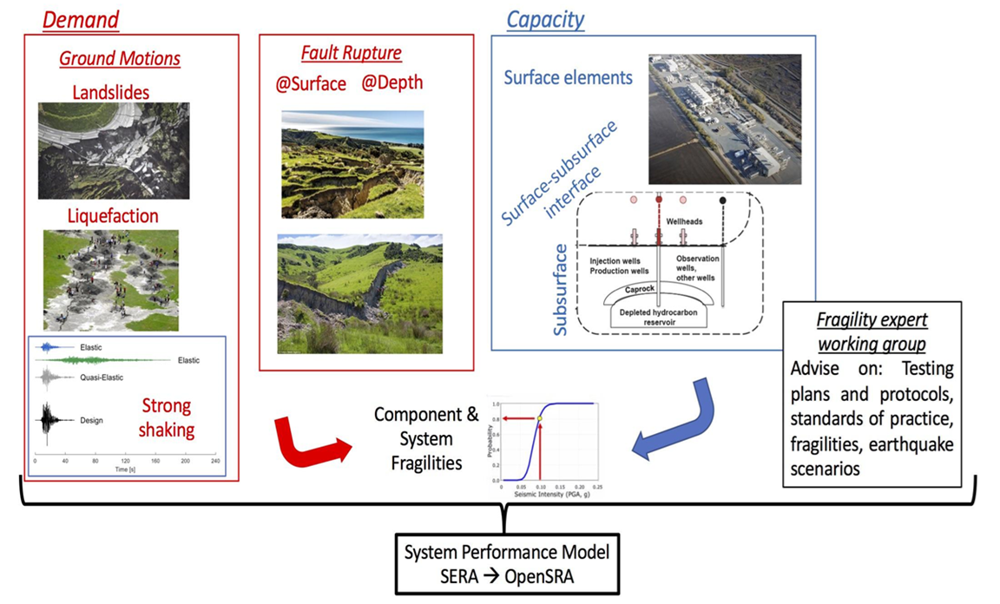

|short name| Framework
======================

The |short name| workflow is shown in the figure presented at the bottom of this page. |short name| follows the performance-based earthquake engineering (**PBEE**) framework from |peer link| (Deierlein et al., 2003):

.. math:: {\lambda}(DV) = {\int\int\int}G{\langle}DV`|`DM{\rangle} dG{\langle}DM`|`EDP{\rangle} dG{\langle}EDP`|`IM{\rangle} d{\lambda}(IM)

Where:

* :math:`\lambda` = mean annual rate of occurrence for rupture scenarios
* **IM**: intensity measures (e.g., PGA, PGV)
* **EDP**: engineering demand parameters (e.g., seismic-induced transient and permenant strains and deformations)
* **DM**: damage measures (e.g., gas leaks, breaks, repairs)
* **DV** = decision values/variables (e.g., safety, costs of repair/upgrade)

Details to the |short name| workflow
------------------------------------

* **1. Site characterization**: User can either define their own list of sites (grid-based or individual points), or use public-domain networks that have been pre-compiled in the release version. Users must specific at the minimum the coordinates associated with each site. Additional information can also be entered (e.g., soil and structural attributes).

* **2. Develop ground motion parameters**: For each site of interest, |short name| screens through a rupture inventory (e.g., UCERF3) for all scenarios within a specified distance (e.g., 100 km) and computes the rupture distance to the nearest segment for each scenario. For each rupture scenario, the magnitude and rupture distance are passed through the ground motion models (GMMs) in |ngawest2 link| to compute the median ground motion intensities (**PGA**, **PGV**) and the event standard deviations.

* **3. Generate random realizations**: A multivariate-sampling procedure is performed using the statistical moments from all the sites to generate realizations of **PGA** and **PGV**. Spatial and spectral correlations are incorporated in the development of the covariance matrix used for sampling.

* **4. Compute demands parameters**: Given the random realizations, the users can choose to compute individual or all engineering demand parameters. For each demand parameter, by default the program will perform the procedure that provides the best result (i.e., lowest uncertainty). The users may also choose specific methods to run.

* **5. Compute damage measures**: Users select from a list of damage measure(s) to compute for. For each damage measure, the users can choose to use specific fragility functions or all of the available functions. Users will also have the option to enter their own fragility functions.

* **6. Compute decision variables**: Similar to damage measures, the users first a decision variable to compute for. For that decision variable, the users can choose to use available correlations or enter their own.

(May decide to revert steps 4 through 6 and have users select what damages they want to see, and then determine which demand paramters are required for calculation.)

